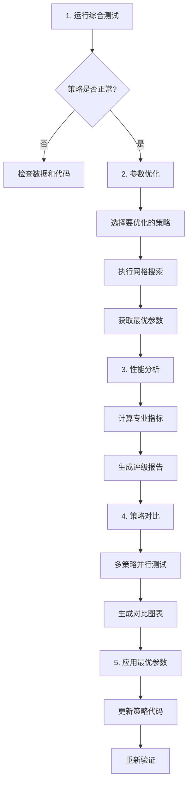

# 量化策略优化操作手册

## 📋 目录

1. [系统概述](#系统概述)
2. [环境准备](#环境准备)
3. [策略模块结构](#策略模块结构)
4. [核心功能使用](#核心功能使用)
5. [策略优化流程](#策略优化流程)
6. [性能分析指南](#性能分析指南)
7. [常见问题解决](#常见问题解决)
8. [最佳实践建议](#最佳实践建议)

---

## 系统概述

### 功能特性

本系统提供完整的量化策略开发、测试、优化和分析工具集：

- ✅ **多策略支持**: SMA双均线、布林线、RSI相对强弱指标
- ✅ **参数优化**: 自动化网格搜索最优参数组合
- ✅ **性能分析**: 夏普比率、最大回撤、VWR等专业指标
- ✅ **可视化对比**: 多维度策略对比图表
- ✅ **智能诊断**: RSI信号分析和参数推荐
- ✅ **数据管理**: MySQL数据库存储，支持增量更新

### 技术栈

- **回测引擎**: Backtrader
- **数据源**: AKShare + MySQL
- **数据分析**: Pandas, NumPy
- **可视化**: Matplotlib
- **数据库**: SQLAlchemy ORM

---

## 环境准备

### 1. 安装依赖

```bash
pip install backtrader pandas numpy matplotlib sqlalchemy pymysql akshare
```

### 2. 配置数据库

编辑 `quant/utils/db_connection.py`：

```python
# 生产环境配置
db_manager = DatabaseManager(use_pro=True, echo_sql=False)
```

或设置环境变量（`.env`文件）：

```env
DB_HOST=8.137.104.120
DB_PORT=3306
DB_USER=your_username
DB_PASSWORD=your_password
DB_NAME=quant_db
```

### 3. 验证安装

```bash
python quant/strategy/test_all_strategies.py
```

预期输出：所有测试通过 ✅

---

## 策略模块结构

```
quant/strategy/
├── sma/                          # SMA双均线策略
│   ├── strategy/
│   │   └── SmaCross.py          # 策略实现（已优化）
│   ├── SmaStrategyScript.py     # 回测主脚本
│   └── sma_cross_test.py        # 批量回测
│
├── boll/                         # 布林线策略
│   ├── BollStrategy.py          # 策略实现
│   └── boll_test.py             # 测试脚本
│
├── rsi/                          # RSI策略
│   ├── RSIStrategy.py           # 策略实现（已优化）
│   ├── RSIStrategyOptimized.py  # 高级优化版
│   └── rsi_test.py              # 测试脚本
│
├── ta_lib/                       # TA-Lib技术指标
│   ├── TaLibStrategy.py
│   └── AdvancedTaLibStrategy.py
│
├── test_all_strategies.py       # 综合测试脚本 ⭐
├── optimize_parameters.py       # 参数优化工具 ⭐
├── performance_analyzer.py      # 性能分析器 ⭐
├── strategy_comparator.py       # 策略对比工具 ⭐
├── diagnose_rsi.py              # RSI诊断工具 ⭐
├── test_sma_optimization.py     # SMA优化测试
└── test_rsi_optimization.py     # RSI优化测试
```

---

## 核心功能使用

### 1. 快速测试所有策略

```bash
python quant/strategy/test_all_strategies.py
```

**功能**:
- 自动测试SMA、布林线、RSI三个策略
- 显示收益率、交易统计等基本信息
- 验证策略是否正常工作

**输出示例**:
```
SMA策略: 收益率 +34.29% ✅
布林线策略: 收益率 -5.86% ⚠️
RSI策略: 收益率 +0.00% ⚠️
```

---

### 2. 参数优化（网格搜索）

#### SMA策略优化

```bash
python quant/strategy/test_sma_optimization.py
```

**测试的参数范围**:
- pfast (短期均线): [5, 7, 10]
- pslow (长期均线): [20, 30, 50]
- stop_loss (止损): [5%, 8%]
- take_profit (止盈): [10%, 15%]
- max (资金比例): [80%, 100%]

**输出**:
```
排名 #1:
  收益率: +34.29%
  参数: pfast=7, pslow=30, stop_loss=5%, take_profit=15%
  
与原始参数对比:
  原始: +22.33%
  最优: +34.29%
  提升: +11.95% ✅
```

#### 交互式参数优化

```bash
python quant/strategy/optimize_parameters.py
```

**支持**:
- SMA策略全面优化（72种组合）
- 布林线策略优化
- RSI策略优化
- 可选择单个策略或全部优化

---

### 3. 性能分析器

```bash
python quant/strategy/performance_analyzer.py
```

**分析指标**:
- 💰 **收益指标**: 收益率、净收益、最终资金
- ⚖️ **风险指标**: 夏普比率、最大回撤、VWR
- 📊 **交易统计**: 总交易次数、胜率、盈亏比
- ⭐ **综合评级**: S/A/B/C/D五级评分

**输出示例**:
```
SMA双均线策略(优化版) - 性能分析报告

收益指标:
  初始资金:     ¥100,000.00
  最终资金:     ¥134,286.08
  净收益:       ¥+34,286.08
  收益率:       +34.29%

风险指标:
  夏普比率:     1.4089
  最大回撤:     7.58%
  VWR指标:      8.9681

交易统计:
  总交易次数:   9
  盈利次数:     6
  亏损次数:     2
  胜率:         66.67%

综合评级: S级 (卓越) ⭐⭐⭐⭐⭐
```

---

### 4. 策略对比工具

```bash
python quant/strategy/strategy_comparator.py
```

**功能**:
- 同时运行多个策略
- 生成4维度对比图表
- 自动保存PNG图片
- 综合评分排名

**生成的图表包含**:
1. 收益率对比柱状图
2. 夏普比率 vs 最大回撤双轴图
3. 胜率对比图
4. 交易频率对比图

**输出文件**:
```
quant/strategy/strategy_comparison_601398_20260515_140137.png
```

---

### 5. RSI策略诊断

```bash
python quant/strategy/diagnose_rsi.py
```

**诊断内容**:
- 测试12种参数组合的信号数量
- 分析RSI指标分布
- 识别买卖信号时间点
- 推荐最优参数

**输出示例**:
```
测试不同RSI参数组合的信号数量

周期  超买  超卖  买入  卖出  总计  评价
7     65    35    82    158   240   活跃 ← 最活跃
10    70    30    36    117   153   活跃 ← 推荐
14    70    30    18    88    106   适中 ← 当前

推荐参数: period=10, upper=70, lower=30
```

---

## 策略优化流程

### 完整优化工作流



### 实际操作步骤

#### Step 1: 基线测试

```bash
# 了解当前策略表现
python quant/strategy/test_all_strategies.py
```

记录各策略的基准收益率。

#### Step 2: 参数优化

```bash
# 优化SMA策略
python quant/strategy/test_sma_optimization.py

# 或交互式优化所有策略
python quant/strategy/optimize_parameters.py
```

找到最优参数组合。

#### Step 3: 性能分析

```bash
# 深入分析策略性能
python quant/strategy/performance_analyzer.py
```

查看夏普比率、最大回撤等专业指标。

#### Step 4: 策略对比

```bash
# 可视化对比
python quant/strategy/strategy_comparator.py
```

生成对比图表，直观查看差异。

#### Step 5: 应用优化

编辑策略文件，更新为最优参数：

**SMA策略** (`quant/strategy/sma/strategy/SmaCross.py`):
```python
params = (
    ('pfast', 7),        # 优化后
    ('pslow', 30),       # 优化后
    ('stop_loss', 0.05),
    ('take_profit', 0.15),  # 优化后
    ('max', 0.8),
)
```

**RSI策略** (`quant/strategy/rsi/RSIStrategy.py`):
```python
params = (
    ('rsi_period', 10),  # 优化后: 14->10
    ('rsi_upper', 70),
    ('rsi_lower', 30),
)
```

#### Step 6: 验证优化

```bash
# 重新测试，确认优化效果
python quant/strategy/test_all_strategies.py
```

---

## 性能分析指南

### 关键指标解读

#### 1. 收益率 (Returns)

- **定义**: 投资回报率
- **公式**: `(最终资金 - 初始资金) / 初始资金 * 100%`
- **优秀标准**: >20%
- **注意**: 高收益可能伴随高风险

#### 2. 夏普比率 (Sharpe Ratio)

- **定义**: 风险调整后收益
- **公式**: `(策略收益 - 无风险利率) / 策略波动率`
- **评级标准**:
  - >2.0: 卓越 ⭐⭐⭐⭐⭐
  - 1.0-2.0: 优秀 ⭐⭐⭐⭐
  - 0.5-1.0: 良好 ⭐⭐⭐
  - 0-0.5: 一般 ⭐⭐
  - <0: 较差 ⭐

#### 3. 最大回撤 (Max Drawdown)

- **定义**: 从最高点到最低点的最大跌幅
- **优秀标准**: <10%
- **可接受**: <20%
- **危险**: >30%

#### 4. 胜率 (Win Rate)

- **定义**: 盈利交易占总交易的比例
- **公式**: `盈利次数 / 总交易次数 * 100%`
- **优秀标准**: >60%
- **注意**: 高胜率不代表高收益（要看盈亏比）

#### 5. VWR指标 (Variability-Weighted Return)

- **定义**: 变异系数收益比
- **含义**: 综合考虑收益和波动性
- **优秀标准**: >5

### 综合评级系统

| 等级 | 分数范围 | 说明 | 建议 |
|------|---------|------|------|
| S级 | 85-100 | 卓越 | 可直接实盘 |
| A级 | 70-84 | 优秀 | 小仓位测试 |
| B级 | 55-69 | 良好 | 继续优化 |
| C级 | 40-54 | 一般 | 大幅改进 |
| D级 | 0-39 | 较差 | 重新设计 |

**评分权重**:
- 收益率: 30%
- 夏普比率: 25%
- 最大回撤: 25%
- 胜率: 20%

---

## 常见问题解决

### 问题1: ModuleNotFoundError: No module named 'quant'

**原因**: Python路径未正确设置

**解决方案**:
```bash
# 在项目根目录运行
cd e:\Project\akshare
python quant/strategy/test_all_strategies.py
```

或在脚本开头添加：
```python
import sys
import os
project_root = os.path.dirname(os.path.abspath(__file__))
sys.path.insert(0, project_root)
```

---

### 问题2: UnicodeEncodeError: 'gbk' codec can't encode character

**原因**: Windows终端不支持emoji字符

**解决方案**:
避免在print中使用emoji，或使用UTF-8编码：
```python
import sys
import io
sys.stdout = io.TextIOWrapper(sys.stdout.buffer, encoding='utf-8')
```

---

### 问题3: ZeroDivisionError: float division by zero

**原因**: RSI_SMA在某些情况下会除以零

**解决方案**:
使用更稳定的RSI (EMA算法)：
```python
# 错误
self.rsi = bt.indicators.RSI_SMA(...)

# 正确
self.rsi = bt.indicators.RSI(...)
```

---

### 问题4: 网络连接失败 (RemoteDisconnected)

**原因**: 系统代理设置或网络问题

**解决方案**:
```bash
# 方法1: 使用禁用代理脚本
python run_update_no_proxy.py

# 方法2: 手动清除代理
$env:HTTP_PROXY=''
$env:HTTPS_PROXY=''
$env:NO_PROXY='*'
```

---

### 问题5: 数据库查询耗时较长

**原因**: 缺少索引或数据量大

**解决方案**:
1. 为常用查询字段添加索引：
```sql
ALTER TABLE stock_history_daily_info_entity 
ADD INDEX idx_symbol_adjust (symbol, adjust);
```

2. 限制查询时间范围：
```python
df = db_orm.get_mysql_data_to_df(
    orm_class=StockHistoryDailyInfoEntity,
    symbol=symbol,
    adjust=adjust,
    fromdate=datetime(2024, 1, 1)  # 只查最近数据
)
```

---

### 问题6: 策略没有产生交易信号

**可能原因**:
1. 参数太严格（如RSI阈值70/30）
2. 股票特性不适合该策略
3. 回测时间段内无明显趋势

**解决方案**:
1. 使用诊断工具分析信号数量：
```bash
python quant/strategy/diagnose_rsi.py
```

2. 调整参数使其更敏感：
```python
# RSI: 降低阈值
('rsi_upper', 65),  # 70->65
('rsi_lower', 35),  # 30->35

# 或缩短周期
('rsi_period', 7),  # 14->7
```

3. 更换测试股票（选择波动性大的）

---

## 最佳实践建议

### 1. 策略选择原则

| 市场环境 | 推荐策略 | 原因 |
|---------|---------|------|
| 趋势行情 | SMA双均线 | 捕捉中长期趋势 |
| 震荡行情 | 布林线 | 高抛低吸 |
| 超买超卖 | RSI | 均值回归 |

### 2. 参数优化建议

- **不要过度拟合**: 在多个股票上验证参数
- **保持简洁**: 参数越少越稳健
- **定期重优化**: 市场变化后重新调参
- **保留原始参数**: 作为对比基线

### 3. 风险管理

- **单笔风险控制**: 止损不超过5%
- **总仓位控制**: 不超过80%资金
- **分散投资**: 同时运行多个不相关策略
- **定期复盘**: 每月分析策略表现

### 4. 回测注意事项

- **数据质量**: 使用前复权数据（qfq）
- **时间跨度**: 至少2年数据
- **手续费**: 设置合理的佣金（0.05%-0.1%）
- **滑点**: 考虑实际交易的滑点成本

### 5. 实盘前检查清单

- [ ] 策略在多个股票上测试通过
- [ ] 夏普比率 > 1.0
- [ ] 最大回撤 < 20%
- [ ] 至少完成50次交易
- [ ] 胜率 > 50%
- [ ] 在不同市场环境下验证
- [ ] 压力测试（极端行情）
- [ ] 设置好止损和风控

---

## 附录

### A. 快捷命令汇总

```bash
# 快速测试
python quant/strategy/test_all_strategies.py

# SMA优化
python quant/strategy/test_sma_optimization.py

# 性能分析
python quant/strategy/performance_analyzer.py

# 策略对比
python quant/strategy/strategy_comparator.py

# RSI诊断
python quant/strategy/diagnose_rsi.py

# 批量回测（谨慎使用）
python quant/strategy/sma/sma_cross_test.py
```

### B. 文件说明

| 文件 | 用途 | 重要程度 |
|------|------|---------|
| test_all_strategies.py | 快速验证策略 | ⭐⭐⭐⭐⭐ |
| performance_analyzer.py | 专业性能分析 | ⭐⭐⭐⭐⭐ |
| strategy_comparator.py | 可视化对比 | ⭐⭐⭐⭐ |
| optimize_parameters.py | 参数网格搜索 | ⭐⭐⭐⭐ |
| diagnose_rsi.py | RSI问题诊断 | ⭐⭐⭐ |
| test_sma_optimization.py | SMA专项优化 | ⭐⭐⭐ |
| test_rsi_optimization.py | RSI专项优化 | ⭐⭐⭐ |

### C. 参考资源

- **Backtrader官方文档**: https://www.backtrader.com/docu/
- **AKShare文档**: https://akshare.akfamily.xyz/
- **TA-Lib指标库**: https://ta-lib.github.io/ta-lib-python/

---

## 版本历史

- **v1.0** (2026-05-15): 初始版本
  - SMA策略参数优化完成
  - RSI策略诊断和优化
  - 性能分析器和对比工具
  - 完整的操作手册

---

**最后更新**: 2026-05-15  
**维护者**: Quant Team  
**联系方式**: [内部联系]
